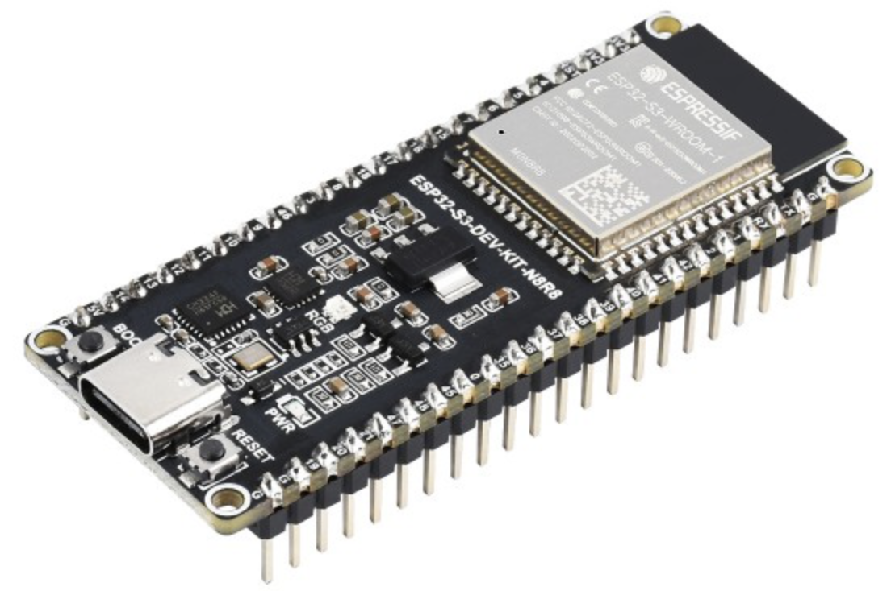
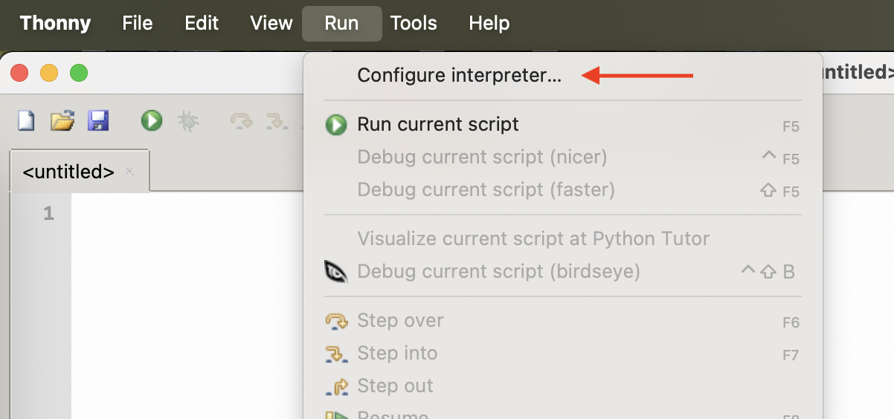
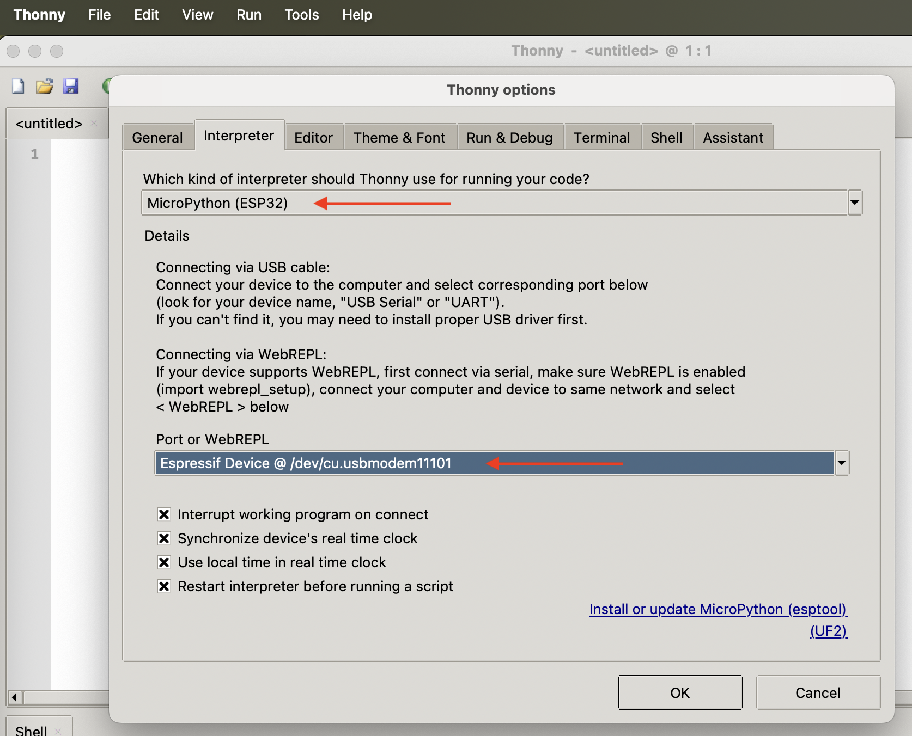
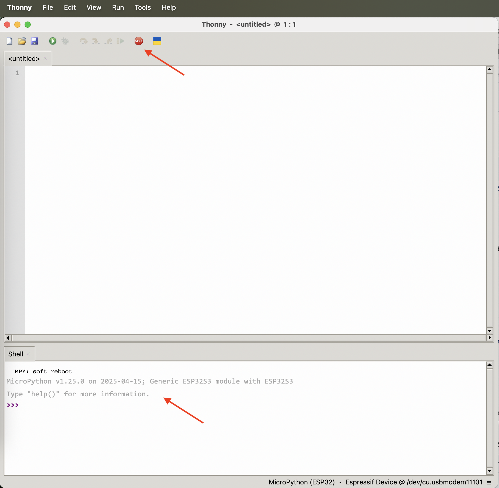

# ESP32

The [ESP32-S3](https://www.waveshare.com/wiki/ESP32-S3-DEV-KIT-N8R8) is a compact-size microcontroller development board. A wide range of sensors and actuators can be connected to the board through its available GPIO pins. Throughout these lessons, you will code the ESP32 to access the sensors and actuators using [Micropython](https://micropython.org).



## Setup

To program the ESP32-S3, you will use the [Thonny IDE](https://thonny.org). Below are the initial steps and configurations needed to create and upload your code to the ESP32-S3 board.

1. Connect the ESP32-S3 board to your computer.

1. Open the Thonny IDE on your computer.

1. In `Run` menu chosse `Configure interpreter`. Select `MicroPython (ESP32)` as the interpreter and `Espressif Device @ ...` as port.




4. Use the `Stop` button and verify that MicroPython is correctly running on the board.



## Hello world

It is traditional when starting out with a new programming language or technology to create a 'Hello World' application - a small application that outputs something like the text `"Hello World"` to show that all the tools are correctly configured.

### Task - Create a MicroPython ´Hello world´ example

1. Add the following code to a file in Thonny IDE:

    ```python
    print('Hello World!')
    ```

    The `print` function prints whatever is passed to it to the console.

1. Save the file as `main.py` to the ESP32 board by selecting the `Save` option from the `File` menu and choosing `MicroPython device` as the destination.

1. Run the code by using using the `Run current script` from `Run` menu

    The following will be in the `Shell` IDE window:

    ```>>> %Run -c $EDITOR_CONTENT

        MPY: soft reboot
        Hello World!
    >>> 
    ```

😀 Your 'Hello World' program was a success!

### Connect the 'hardware'

As a second 'Hello World' step, you will run the CounterFit app and connect your code to it. This is the virtual equivalent of plugging in some IoT hardware to a dev kit.

#### Task - connect the 'hardware'

1. From the VS Code terminal, launch the CounterFit app with the following command:

    ```sh
    counterfit
    ```

    The app will start running and open in your web browser:

    

    It will be marked as *Disconnected*, with the LED in the top-right corner turned off.

1. Add the following code to the top of `app.py`:

    ```python
    from counterfit_connection import CounterFitConnection
    CounterFitConnection.init('127.0.0.1', 5000)
    ```

    This code imports the `CounterFitConnection` class from the `counterfit_connection` module, which comes from the `counterfit-connection` pip package you installed earlier. It then initializes a connection to the CounterFit app running on `127.0.0.1`, which is an IP address you can always use to access your local computer (often referred to as *localhost*), on port 5000.

    > 💁 If you have other apps running on port 5000, you can change this by updating the port in the code, and running CounterFit using `CounterFit --port <port_number>`, replacing `<port_number>` with the port you want to use.

1. You will need to launch a new VS Code terminal by selecting the **Create a new integrated terminal** button. This is because the CounterFit app is running in the current terminal.

    

1. In this new terminal, run the `app.py` file as before. The status of CounterFit will change to **Connected** and the LED will light up.

    

> 💁 You can find this code in the [code/virtual-device](code/virtual-device) folder.

😀 Your connection to the hardware was a success!
