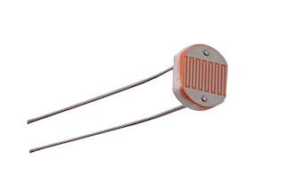
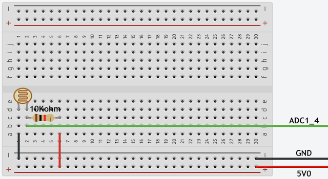

# Build a nightlight - ESP32

In this part of the lesson, you will add a light sensor to your ESP32.

## Hardware

The sensor for this lesson is a **light sensor** that uses a [photoresistor](https://wikipedia.org/wiki/Photoresistor) to convert light to an electrical signal. This is an analog sensor that sends an integer value from 0 to 4095 indicating a relative amount of light that doesn't map to any standard unit of measurement such as [lux](https://wikipedia.org/wiki/Lux).



### Connect the light sensor

The light sensor that is used to detect the light levels needs to be connected to the ESP32 board pins. The pinout diagram helps you choose the appropriate pins for connecting sensors by showing the function of each pin on the board.


#### Task - connect the light sensor

1. Disconnect the ESP32 board from the computer.

1. Using a breadboard and jumper wires, connect the light sensor to the appropriate pins on the ESP32, following the diagram below.



## Program the light sensor

The ESP32 can now be programmed using the light sensor.

### Task - program the light sensor

Program the ESP32.

1. Connect the ESP32 to the computer.

1. Using Thonny create a new file.

1. Add the following code to the file to import some required libraries:

    ```python
    import time
    from machine import ADC
    ```

    The `import time` statement imports the `time` module that will be used later in this assignment.

    The `from machine import ADC` statement imports the `ADC` module from the MicroPython libraries. This library has code to interact with analog sensors.

1. Add the following code after the code above to create an instance of the class that manages the light sensor:

    ```python
    light_sensor = ADC(5)
    ```

    The line `light_sensor = ADC(5)` creates an instance of the `ADC` class connecting to pin **ADC1_4** - the analog pin that the light sensor is connected to.

1. Add an infinite loop after the code above to poll the light sensor value and print it to the console:

    ```python
    while True:
        light = light_sensor.read()
        print('Light level:', light)
    ```

    This will read the current light level on a scale of 0-4095 using the `read` property of the `ADC` class. This property reads the analog value from the pin. This value is then printed to the console.

1. Add a small sleep of one second at the end of the `loop` as the light levels don't need to be checked continuously. A sleep reduces the power consumption of the device.

    ```python
    time.sleep(1)
    ```

1. Save the file to the `MicroPython device` and run the code:

    Light values will be output to the `Shell` Thonny window. Cover and uncover the light sensor, and the values will change:

    ```output
    >>> %Run -c $EDITOR_CONTENT

    MPY: soft reboot
    Light level: 1034
    Light level: 1034
    Light level: 1034
    Light level: 130
    Light level: 4095
    Light level: 2090
    ```

> 💁 You can find this code in the [code-sensor/esp32](code-sensor/esp32) folder.

😀 Adding a sensor to your nightlight program was a success!
