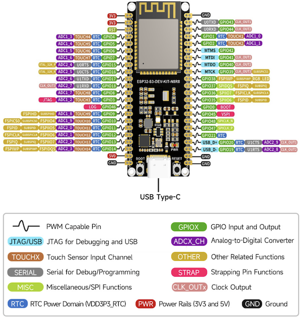

# Measure temperature - ESP32

In this part of the lesson, you will add a temperature sensor to your ESP32.

## Hardware

The sensor you'll use is a [DHT11 humidity and temperature sensor](https://www.seeedstudio.com/Grove-Temperature-Humidity-Sensor-DHT11.html), combining 2 sensors in one package. This is fairly popular, with a number of commercially available sensors combining temperature, humidity and sometimes atmospheric pressure. The temperature sensor component is a negative temperature coefficient (NTC) thermistor, a thermistor where the resistance decreases as the temperature increases.

This is a digital sensor, so has an onboard ADC to create a digital signal containing the temperature and humidity data that the microcontroller can read.


### Connect the temperature sensor

The temperature sensor needs to be connected to the ESP32 board pins. The pinout diagram helps you choose the appropriate pins for connecting sensors by showing the function of each pin on the board.



#### Task - connect the temperature sensor

1. Disconnect the ESP32 board from the computer.

1. Using a [breadboard](https://www.elecrow.com/blog/how-to-use-a-breadboard-for-beginners.html) and [jumper wires](https://blog.sparkfuneducation.com/what-is-jumper-wire), connect the temperature sensor to the appropriate pins on the ESP32, following the diagram below.


## Program the temperature sensor

The ESP32 can now be programmed using the temperature sensor.

### Task - program the temperature sensor

Program the ESP32.

1. Connect the ESP32 to the computer.

1. Using Thonny create a new file.

1. Add the following code to the file to import some required libraries:

    ```python
    import time
    from seeed_dht import DHT
    ```

    The `from seeed_dht import DHT` statement imports the `DHT` sensor class to interact with a Grove temperature sensor from the `seeed_dht` module.

1. Add the following code after the code above to create an instance of the class that manages the temperature sensor:

    ```python
    sensor = DHT("11", 5)
    ```

    This declares an instance of the `DHT` class that manages the **D**igital **H**umidity and **T**emperature sensor. The first parameter tells the code the sensor being used is the *DHT11* sensor - the library you are using supports other variants of this sensor. The second parameter tells the code the sensor is connected to digital port `D5` on the Grove base hat.

    > ✅ Remember, all the sockets have unique pin numbers. Pins 0, 2, 4, and 6 are analog pins, pins 5, 16, 18, 22, 24, and 26 are digital pins.

1. Add an infinite loop after the code above to poll the temperature sensor value and print it to the console:

    ```python
    while True:
        _, temp = sensor.read()
        print(f'Temperature {temp}°C')
    ```

    The call to `sensor.read()` returns a tuple of humidity and temperature. You only need the temperature value, so the humidity is ignored. The temperature value is then printed to the console.

1. Add a small sleep of ten seconds at the end of the `loop` as the temperature levels don't need to be checked continuously. A sleep reduces the power consumption of the device.

    ```python
    time.sleep(10)
    ```

1. Save the file to the `MicroPython device` and run the code:

    You should see temperature values being output to the `Shell` Thonny window. Use something to warm the sensor, such as pressing your thumb on it, or using a fan to see the values change:

    ```output
    >>> %Run -c $EDITOR_CONTENT

    MPY: soft reboot
    Temperature 26°C
    Temperature 26°C
    Temperature 28°C
    Temperature 30°C
    Temperature 32°C
    ```

> 💁 You can find this code in the [code-temperature/pi](code-temperature/pi) folder.

😀 Your temperature sensor program was a success!
